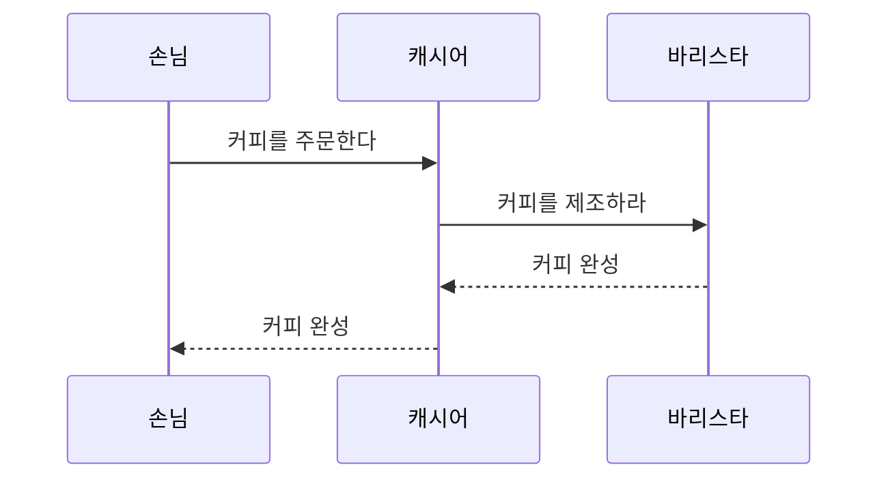

# 객체지향의 사실과 오해
## 01. 협력하는 객체들의 공동체
### 커피 주문 구현

```mermaid
sequenceDiagram
    participant 손님
    participant 캐시어
    participant 바리스타
    손님->>캐시어: 커피를 주문한다
    캐시어->>바리스타: 커피를 제조하라
    바리스타-->>캐시어: 커피 완성
    캐시어-->>손님: 커피 완성
```

#### Customer
- 커피를 주문할 수 있다

#### Cashier
- 손님으로부터 주문을 받는다

#### Barista
- 주문된 커피를 제조한다

